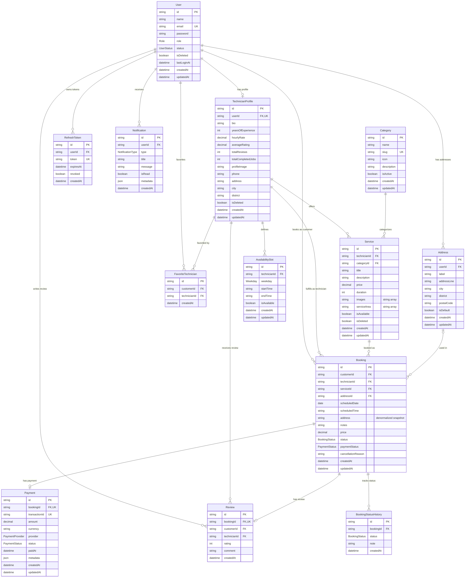

# 🔧 FixItNow Backend API

> A scalable RESTful backend API for a Home Service Marketplace built with **Node.js, Express.js, TypeScript, Prisma, PostgreSQL, and Stripe**.


---


FixItNow is a RESTful backend API for a home service marketplace where customers can book professional technicians for different home services such as plumbing, electrical, cleaning, painting, and more.

The system supports three different user roles:

- 👤 Customer
- 🛠 Technician
- 👨‍💼 Admin

Customers can browse available services, create bookings, make online payments, and leave reviews.

Technicians can manage their service profile, availability, and bookings.

Admins can manage the entire platform including users, bookings, categories, and services.

---

# 🚀 Live Links

| Resource | Link |
|----------|------|
| 🌐 Live API | https://fixitnow-backend-tau.vercel.app/ |
| 📮 Postman Documentation | https://documenter.getpostman.com/view/52004920/2sBY4Qtffz |
| 💻 GitHub Repository | https://github.com/mahfahim/FixItNow-backend |


---

# 👨‍💻 Admin Credentials

```
Email:
fahim@gmail.com

Password:
123456
```

---

# ✨ Features

## Authentication

- JWT Authentication
- Role Based Authorization
- Secure Password Hashing (bcrypt)
- Cookie Based Authentication

---

## Customer

- Register & Login
- Browse Services
- View Technicians
- Create Booking
- View Booking History
- Make Payment
- Submit Reviews

---

## Technician

- Register & Login
- Create Technician Profile
- Manage Services
- Update Availability
- Accept / Decline Booking
- Complete Jobs

---

## Admin

- Manage Users
- Manage Categories
- Manage Services
- View All Bookings
- Block / Unblock Users

---

## Payment

- Stripe Integration
- Payment Intent
- Payment Verification
- Payment Status Tracking

---

# 🛠 Tech Stack

## Backend

- Express.js
- TypeScript

## Database

- PostgreSQL
- Prisma ORM

## Authentication

- JWT
- bcrypt

## Validation

- Zod

## Payment

- Stripe

## Deployment

- Vercel

---

# 📂 Folder Structure

```
FIXITNOW-BACKEND/
├── .vercel/
├── dist/
├── generated/
├── node_modules/
├── prisma/
├── scripts/
├── src/
│   ├── config/
│   │   ├── index.ts
│   │   └── stripe.config.ts
│   ├── errors/
│   │   └── AppError.ts
│   ├── lib/
│   │   └── prisma.ts
│   ├── middlewares/
│   │   ├── auth.ts
│   │   ├── globalErrorHandler.ts
│   │   ├── notFound.ts
│   │   └── validateRequest.ts
│   ├── modules/
│   │   ├── admin/
│   │   │   ├── admin.controller.ts
│   │   │   ├── admin.interface.ts
│   │   │   ├── admin.route.ts
│   │   │   ├── admin.service.ts
│   │   │   └── admin.validation.ts
│   │   ├── auth/
│   │   │   ├── auth.controller.ts
│   │   │   ├── auth.interface.ts
│   │   │   ├── auth.route.ts
│   │   │   ├── auth.service.ts
│   │   │   └── auth.validation.ts
│   │   ├── booking/
│   │   │   ├── booking.controller.ts
│   │   │   ├── booking.interface.ts
│   │   │   ├── booking.route.ts
│   │   │   ├── booking.service.ts
│   │   │   └── booking.validation.ts
│   │   ├── category/
│   │   │   ├── category.controller.ts
│   │   │   ├── category.interface.ts
│   │   │   ├── category.route.ts
│   │   │   ├── category.service.ts
│   │   │   └── category.validation.ts
│   │   ├── payment/
│   │   │   ├── payment.controller.ts
│   │   │   ├── payment.interface.ts
│   │   │   ├── payment.route.ts
│   │   │   ├── payment.service.ts
│   │   │   ├── payment.utils.ts
│   │   │   └── payment.validation.ts
│   │   ├── review/
│   │   │   ├── review.controller.ts
│   │   │   ├── review.interface.ts
│   │   │   ├── review.route.ts
│   │   │   ├── review.service.ts
│   │   │   └── review.validation.ts
│   │   ├── service/
│   │   │   ├── service.controller.ts
│   │   │   ├── service.interface.ts
│   │   │   ├── service.route.ts
│   │   │   ├── service.service.ts
│   │   │   └── service.validation.ts
│   │   └── technician/
│   │       ├── technician.controller.ts
│   │       ├── technician.interface.ts
│   │       ├── technician.route.ts
│   │       ├── technician.service.ts
│   │       └── technician.validation.ts
│   ├── utils/
│   │   ├── catchAsync.ts
│   │   ├── jwt.ts
│   │   ├── pick.ts
│   │   └── sendResponse.ts
│   ├── app.ts
│   └── server.ts
├── .env
├── .gitignore
├── package-lock.json
├── package.json
├── prisma.config.ts
├── README.md
├── tsconfig.json
├── tsup.config.ts
└── vercel.json

```

---

# ⚙️ Installation

## Clone Repository

```bash
git clone https://github.com/mahfahim/FixItNow-backend.git
```

```
cd FixItNow-backend
```

---

## Install Dependencies

```bash
npm install
```

---

## Environment Variables

Create a `.env` file.

```env
# Server Setup
PORT=YOUR_PORT
NODE_ENV=YOUR_NODE_ENV
APP_URL=YOUR_APP_URL

# Database Connection (Prisma / PostgreSQL)
DATABASE_URL=YOUR_DATABASE_URL

# Security & Authentication
BCRYPT_SALT_ROUNDS=YOUR_BCRYPT_SALT_ROUNDS
JWT_ACCESS_SECRET=YOUR_JWT_ACCESS_SECRET
JWT_REFRESH_SECRET=YOUR_JWT_REFRESH_SECRET
JWT_ACCESS_EXPIRES_IN=YOUR_JWT_ACCESS_EXPIRES_IN
JWT_REFRESH_EXPIRES_IN=YOUR_JWT_REFRESH_EXPIRES_IN

# Stripe Payment Gateway
STRIPE_SECRET_KEY=YOUR_STRIPE_SECRET_KEY
STRIPE_WEBHOOK_SECRET=YOUR_STRIPE_WEBHOOK_SECRET
STRIPE_SUCCESS_URL=YOUR_STRIPE_SUCCESS_URL
STRIPE_CANCEL_URL=YOUR_STRIPE_CANCEL_URL
```

---

## Generate Prisma Client

```bash
npx prisma generate
```

---

## Run Migration

```bash
npx prisma migrate dev
```

---

## Seed Database

```bash
npm run seed
```

---

## Run Development Server

```bash
npm run dev
```

---

## Build Project

```bash
npm run build
```

---

## Run Production

```bash
npm start
```

---

# 📚 API Endpoints

## Authentication

| Method | Endpoint |
|---------|----------|
| POST | /api/auth/register |
| POST | /api/auth/login |
| POST | /api/auth/refresh-token |
| GET | /api/auth/me |
| PATCH | /api/auth/me |
| POST | /api/auth/address |

---

## Categories

| Method | Endpoint |
|---------|----------|
| GET | /api/categories/ |
| GET | /api/categories/:id |
| POST | /api/categories/ |
| PATCH | /api/categories/:id |
| DELETE | /api/categories/:id |

---

## Services

| Method | Endpoint |
|---------|----------|
| GET | /api/services/ |
| GET | /api/services/:id |
| POST | /api/services/ |
| PATCH | /api/services/:id |
| DELETE | /api/services/:id |

---

## Technician

| Method | Endpoint |
|---------|----------|
| GET | /api/technicians/bookings |
| PATCH | /api/technicians/bookings/:id |
| PATCH | /api/technicians/profile |
| PATCH | /api/technician/availability |
| GET | /api/technician/ |
| GET | /api/technician/:id |

---

## Booking

| Method | Endpoint |
|---------|----------|
| POST | /api/bookings/ |
| GET | /api/bookings/ |
| GET | /api/bookings/:id |
| PATCH | /api/bookings/:id/status |

---

## Payment

| Method | Endpoint |
|---------|----------|
| POST | /api/payment/create |
| POST | /api/payment/confirm |
| POST | /api/payment/refund |
| GET | /api/payment/history |
| GET | /api/payment/ |
| GET | /api/payment/:id |

---

## Review

| Method | Endpoint |
|---------|----------|
| POST | /api/review/ |
| GET | /api/review/ |
| GET | /api/review/my-reviews |
| GET | /api/review/technician/:technicianId |
| GET | /api/review/booking/:bookingId |

---

## Admin

| Method | Endpoint |
|---------|----------|
| GET | /api/admin/users |
| PATCH | /api/admin/users/:id |
| GET | /api/admin/bookings |
| GET | /api/admin/categories |
| POST | /api/admin/categories |
| GET | /api/admin/reviews |
| DELETE | /api/admin/reviews/:id |


---

# 🗄 Database Schema

## ER Diagram





---

## Database Tables


- User
- TechnicianProfile
- Service
- Category
- Booking
- BookingStatusHistory
- Payment
- Review
- Address
- AvailabilitySlot
- FavoriteTechnician
- Notification
- RefreshToken

---

## Relationships

| Source Entity | Target Entity | Relationship Type | Description |
| --- | --- | --- | --- |
| **User** | **TechnicianProfile** | One-to-One `(1 : 0..1)` | A user can optionally have a technician profile. |
| **User** | **Address** | One-to-Many `(1 : N)` | A user can save multiple addresses. |
| **User** | **Booking** | One-to-Many `(1 : N)` | A user (customer) can make multiple bookings. |
| **User** | **Review** | One-to-Many `(1 : N)` | A user (customer) can write multiple reviews. |
| **User** | **FavoriteTechnician** | One-to-Many `(1 : N)` | A user can favorite multiple technicians. |
| **User** | **Notification** | One-to-Many `(1 : N)` | A user can receive multiple system notifications. |
| **User** | **RefreshToken** | One-to-Many `(1 : N)` | A user can have multiple active session tokens. |
| **TechnicianProfile** | **Service** | One-to-Many `(1 : N)` | A technician can offer multiple services. |
| **TechnicianProfile** | **Booking** | One-to-Many `(1 : N)` | A technician can fulfill multiple service bookings. |
| **TechnicianProfile** | **Review** | One-to-Many `(1 : N)` | A technician receives reviews from multiple bookings. |
| **TechnicianProfile** | **AvailabilitySlot** | One-to-Many `(1 : N)` | A technician sets multiple weekly time slots. |
| **TechnicianProfile** | **FavoriteTechnician** | One-to-Many `(1 : N)` | A technician can be favorited by multiple customers. |
| **Category** | **Service** | One-to-Many `(1 : N)` | A category contains multiple services. |
| **Service** | **Booking** | One-to-Many `(1 : N)` | A service can be booked multiple times. |
| **Address** | **Booking** | One-to-Many `(0..1 : N)` | An address can be attached to multiple bookings. |
| **Booking** | **Payment** | One-to-One `(1 : 0..1)` | A booking has zero or one payment record. |
| **Booking** | **Review** | One-to-One `(1 : 0..1)` | A booking can have at most one customer review. |
| **Booking** | **BookingStatusHistory** | One-to-Many `(1 : N)` | A booking logs multiple status change events. |

---

# 🧪 Error Response Format

```json
{
  "success": false,
  "message": "Validation Error",
  "errorDetails": [
    {
      "field": "email",
      "message": "Email is required"
    }
  ]
}
```

---

# ✅ Validation

This project performs server-side validation using **Zod**.

---

# 🔐 Authentication

JWT Authentication

Role Based Authorization

Protected Routes

Secure Password Hashing

---

# 💳 Payment Gateway

Stripe Payment Gateway

Payment Intent

Payment Confirmation

Payment Status Tracking

---

# 📦 Deployment

Backend deployed on

- Vercel

Database

- PostgreSQL

---

# 📄 API Documentation

Postman Documentation

https://documenter.getpostman.com/view/52004920/2sBY4Qtffz

---


